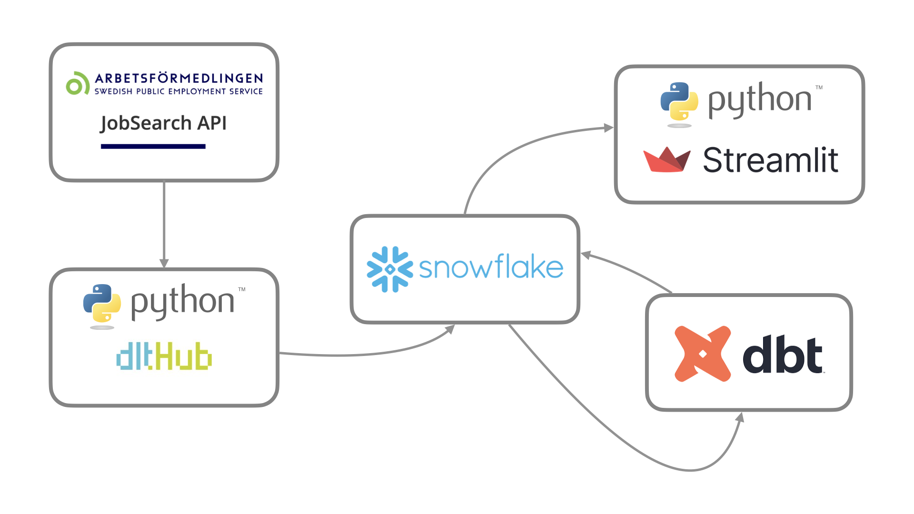

# ETL Pipeline and Streamlit Dashboard for Arbetsförmedlingen

This project implements an ETL pipeline to extract job market data from Arbetsförmedlingen’s Jobtech API, transform and model it in Snowflake, and visualize it in an interactive Streamlit dashboard.

The goal is to help talent acquisition specialists easily filter and analyze candidate data in specific occupational fields, enabling them to identify and approach suitable candidates more effectively.

